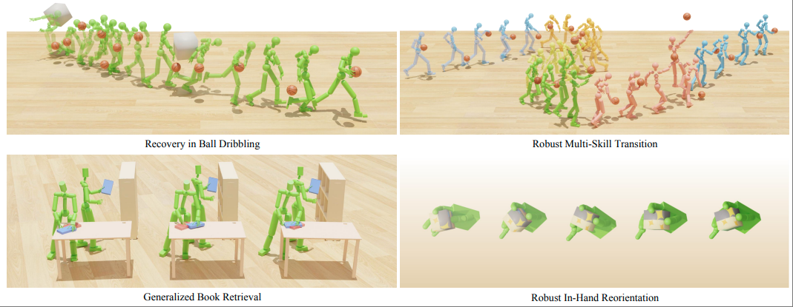

<div align="center">
<h2><font color="#3c9ff7"> SkillMimic-V2</font>: Learning Robust and Generalizable Interaction Skills from Sparse and Noisy Demonstrations</h2>

[Runyi Yu*](https://ingrid789.github.io/IngridYu/), [Yinhuai Wang*](https://wyhuai.github.io/info/), [Qihan Zhao*](https://scholar.google.com/citations?hl=en&user=36UHwBQAAAAJ), Hok Wai Tusi, [Jingbo Wang](https://ece.hkust.edu.hk/pingtan), [Ping Tan]() and [Qifeng Chen](https://cqf.io)


<strong>is Accpeted by Siggraph 2025</strong>

<a href='https://arxiv.org/abs/xxxx.xxxxx'></a> <a href='https://ingrid789.github.io/SkillMimicV2/'>  [](https://github.com/Ingrid789/SkillMimic-V2,pko) <a href='https://youtu.be/jk94jXUsyhE'></a>
</div>

<!-- # SkillMimic-V2
[Paper](https://arxiv.org/abs/xxxx.xxxxx) | [Project Page](https://ingrid789.github.io/SkillMimicV2/) | [Video](https://youtu.be/jk94jXUsyhE)

Official code release for the following paper:
"**SkillMimic-V2: Learning Robust and Generalizable Interaction Skills from Sparse and Noisy Demonstrations**" -->



Our framework enables physically simulated robots to learn robust and generalizable interaction skills from sparse demonstrations: (top left) Learning sustained and robust dribbling from a single, brief demonstration; (top right) acquiring robust skill transitions from fragment skill demonstrations; (bottom left) generalizing book grasping to varied poses from one demonstration; and (bottom right) learning to reorientate a cube from a single grasp pose.

## TODOs
- [] Release models on locomotion task.

- [] Release models on household manipulation task.

- [X] Release models on ballplay task.

- [X] Release training and evaluation code.

## Installation 💽
Please following the Installation instructions of [SkillMimic](https://github.com/wyhuai/SkillMimic). After that you should run the following commands:
```
pip install six
pip install pytorch-lightning==1.9.0
```

## Pre-Trained Models
Pre-trained models are available at `tasks/data/models/`

## BallPlay Skill Policy ⛹️‍♂️
The skill policy can be trained from sctrach, without the need for designing case-by-case skill rewards. Our method allows a single policy to learn a large variety of basketball skills from a dataset that contains diverse skills. 

### Inference
Run the following command (Runyi Version):
```
python tasks/run.py --test --task SkillMimicBallPlayLocalHistUnifiedRISBuffernode (!the name needs to be changed) \
--num_envs 2 \
--cfg_env skillmimic/data/cfg/skillmimic_hist60.yaml \
--cfg_train skillmimic/data/cfg/train/rlg/skillmimic.yaml \
--hist_length 60 \
--hist_ckpt hist_encoder/BallPlay/hist_model.pth \
--motion_file skillmimic/data/motions/CVPR_experiment/exp1_planb \
--state_init 2 \
--episode_length 600 \
--checkpoint models/ballplay/Ours/model.pth
```
- If your computer has more than 1 GPU, add `DRI_PRIME=1` before the above command, otherwise you may encounter display issues.
- You may control the skill switching using your keyboard. By default, the key and skill correspondence are as follows:
`←: dribble left`, `↑: dribble forward`, `→: dribble right`, `W: shot`, `E: layup`.
- You may change `--motion_file` to alter the initialization, or add `--state_init frame_number` to initialize from a specific reference state (Default: random reference state initialization).
- To view the HOI dataset, add `--play_dataset`.
- To save the images, add `--save_image` to the command, and the images will be saved in `tasks/data/images/{timestamp}`.
- To transform the images into a video, run the following command, and the video can be found in `tasks/data/videos`.
```
python tasks/utils/make_video.py --image_path tasks/data/images/{timestamp} --fps 60
```

To test the baseline SkillMimic model, run the following command:
```
python tasks/run.py --test --task SkillMimicBallPlay \
--num_envs 2 \
--cfg_env skillmimic/data/cfg/skillmimic_test.yaml \
--cfg_train skillmimic/data/cfg/train/rlg/skillmimic.yaml \
--motion_file skillmimic/data/motions/CVPR_experiment/exp1_planb \
--state_init 2 \
--episode_length 600 \
--checkpoint models/BallPlay/SkillMimic/model.pth
```

### Training
Before training the skill policy, you have to train the history encoder first.
```
python tasks/utils/state_prediction_ballplay.py (! Needs to be change)
```

After that you can run the following command to train a ballplay skill policy(Runyi Version):
```
python tasks/run.py --task SkillMimicBallPlayLocalHistUnifiedRISBuffernode (!the name needs to be changed) \
--cfg_env tasks/data/cfg/skillmimic_hist60.yaml \
--cfg_train tasks/data/cfg/train/rlg/skillmimic.yaml \
--hist_length 60 \
--hist_ckpt output/tb_logs/comprehensive_model/exp1_planb/checkpoints/epoch=999-step=4000.ckpt \
--motion_file tasks/data/motions/CVPR_experiment/exp1_planb \
--state_init_random_prob 0.1 \
--state_switch_prob 0.1 \
--graph_file tasks/data/preprocess/ballplay.pkl \
--reweight --reweight_alpha 1.0 (看看是不是给他俩合并一下) \
--use_old_reweight (!needs to be changed) \
--headless
```
- During the training, the latest checkpoint model.pth will be regularly saved to output/, along with a Tensorboard log.
- `--cfg_env` specifies the environment configurations, such as number of environments, dataFPS, ball properties, etc.
- `--cfg_train` specifies the training configurations, such as learning rate, maximum number of epochs, network settings, etc.
- `--motion_file` can be changed to train on different data, e.g., `--motion_file tasks/data/motions/BallPlay-Pick`.
- `--state_init_random_prob` specifies the state randomization probability.
- `--state_switch_prob` specifies the state transition probability.
- `--graph_file` specifies offline constructed state transition graph (STG) file.
- `--use_old_reweight` 这个是不是还有必要？
- `--headless` is used to disable visualization.

## Household Manipulation Policy 🤹

## Locomotion Policy 🏃‍♂️

## BallPlay Match Policy ⛹️‍♂️

## Our works on HOI Imitation Learning 👏
[PhysHOI](https://github.com/wyhuai/PhysHOI):Physics-Based Imitation of Dynamic Human-Object Interaction

[SkillMimic](https://github.com/wyhuai/SkillMimic): Learning Basketball Interaction Skills from Demonstrations

## References 🔗
If you find this repository useful for your research, please cite the following work.
```
@misc{yu2025skillmimicv2,
      title={SkillMimic-V2: Learning Robust and Generalizable Interaction Skills from Sparse and Noisy Demonstrations }, 
      author={Runyi Yu, Yinhuai Wang, Qihan Zhao, Hok Wai Tsui, Jingbo Wang, Ping Tan and Qifeng Chen},
      year={2025},
      eprint={xxxx.xxxx},
      archivePrefix={arXiv},
      primaryClass={cs.CV}
    }
```

## Acknowledgements 👏
The household manipulation dataset used in this work is derived from [Parahome](https://github.com/snuvclab/ParaHome). If you utilize the processed motion data from our work in your research, please ensure proper citation of the original ParaHome publication.
